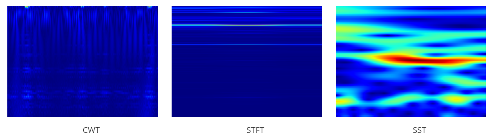
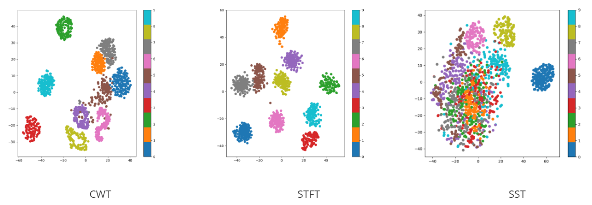

# A_Deep_Learning_Method_for_Bearing_Fault_Diagnosis_Based_on_Time-Frequency_Image
Innovative bearing fault diagnosis using SST algorithm for time-frequency images. Accurately transform signals into efficient time-frequency representations. Leverage deep learning for precise diagnosis. Open-source for collaboration, advancing bearing fault diagnosis.

    
    
Time-frequency images corresponding to the three transformation methods

    
    
The T-SNE feature maps corresponding to the three transformation methods

    
    
Fourteen fold accuracy of three transformation methods under DeepViT model

