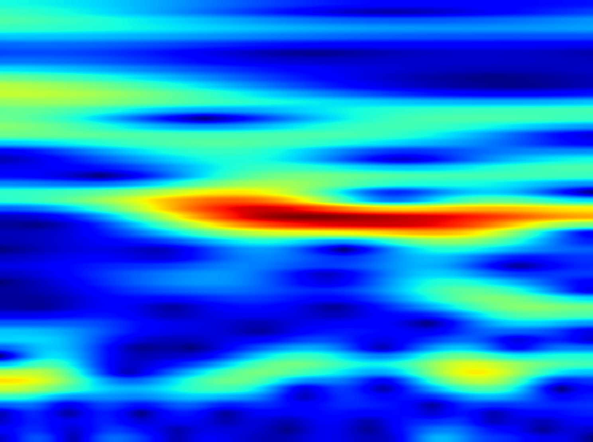
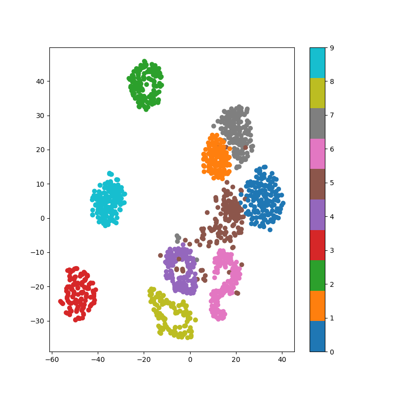
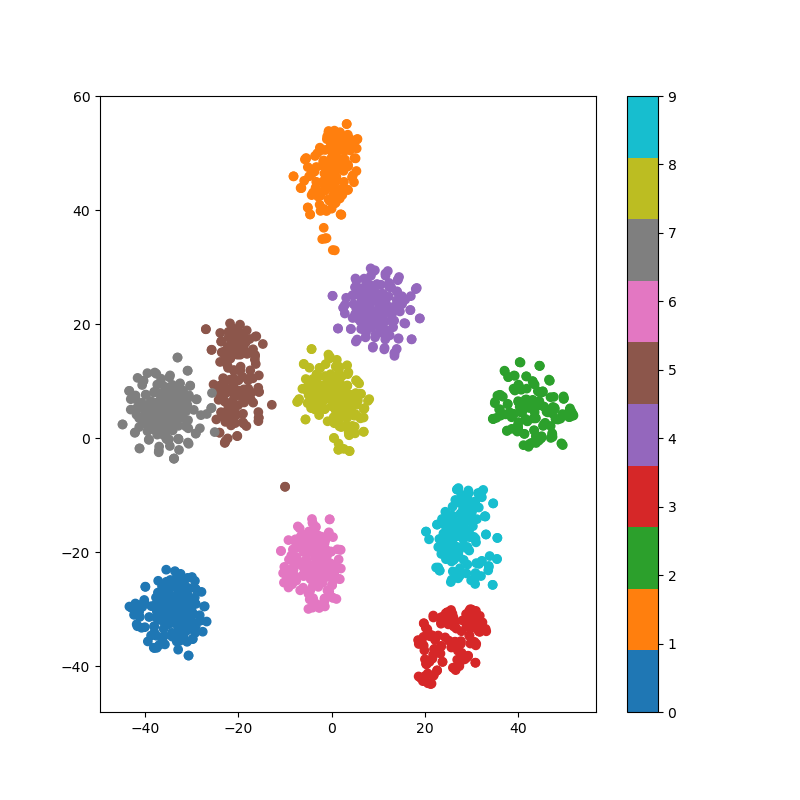
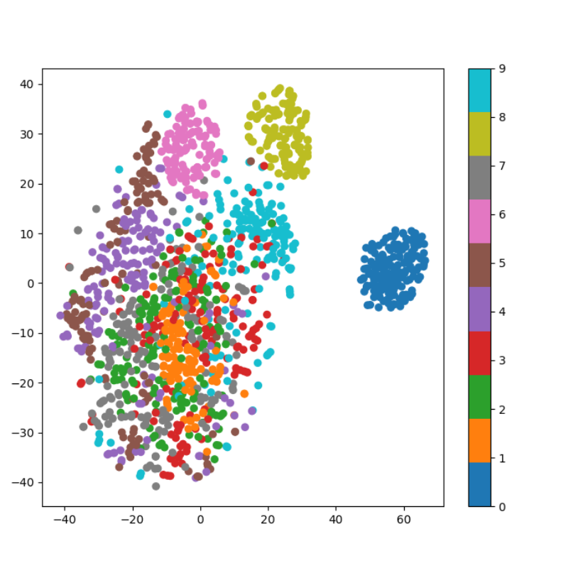

# A_Deep_Learning_Method_for_Bearing_Fault_Diagnosis_Based_on_Time-Frequency_Image
Innovative bearing fault diagnosis using SST algorithm for time-frequency images. Accurately transform signals into efficient time-frequency representations. Leverage deep learning for precise diagnosis. Open-source for collaboration, advancing bearing fault diagnosis.

    

        
        
CWT

    

    

        
        
STFT

    

    

        
        
SST

    

    

        
        
CWT

    

    

        
        
STFT

    

    

        
        
SST

    

